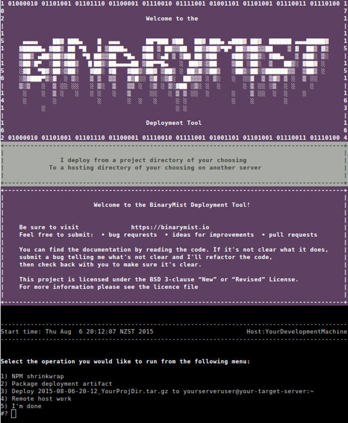

# Licence

This project is licensed under the `BSD 3-clause “New” or “Revised” License`. For more information please see the licence file

# Usage

First rename the `package-deploy.cfg-template` to `package-deploy.cfg` and open the file to make some environmental modifications.  
The following variables can be set before runtime or during the running of the script at menu prompt:

    targetServerUser="<The user you use to login to the server you want to host from>"
    targetServer="<The server you want to host from>"
    sshPort="<Self explanatory>"

The following variables may need to be set before the script is run if they don't suite your needs as is, as there are no prompts for these currently:

    sourceDeployment="</End directory that holds the source you want deployed>"
    deploymentSourceDir="$homeDir/Source/$sourceDeployment"
    readonly yearMonthDateHourMin=$(date '+%Y-%m-%d-%H-%M')
    readonly logFile="/mnt/HDD/Logs/package-deploy-$yearMonthDateHourMin.log"
    readonly publicWebHostingDir="/var/www"
    readonly projectHostingDir="<directory within $publicWebHostingDir usually>"
    readonly projectHostingUser="<owner of $projectHostingDir and files within>"
    readonly initUnitFile="<systemd unit name>.service"

`package-deploy` is the main script which drives the menu and the work that gets executed on the machine you want to deploy your code from.  
When you're first starting out, what I do when I run the `Remote host work` option is to comment out the remote functions within the file `remoteWork` that I don't wnat to run.
I.E. I just run each in order, starting with the first like this:

    create_rollback_of_project_hosting_dir
    #clear_out_target_hosting_directory
    #extract_remoteTaredDeployment_files_to_remoteProjectHostingDir
    #update_file_ownership_and_perms_of_files_in_remoteProjectHostingDir
    #restart_webapp

When you're making changes to the `remoteWork` file. You don't need to restart the main script each time you execute the "Remote host work" main menu option, as the `remoteWork` script is directed to a shell command on the local side, then used as a SSH argument each time we SSH ("Remote host work") to the target deployment server.
The function that does this is `remote_host_work`. Bear in mind that each time you restart the main script, the date fields are repopulated, so new deployment files will be created. this is not usually what you want to happen, unless you actually want to repackage another source deployment.

## sudoers

Add all commands in the `remoteWork` file that are prefixed with `sudo` to the `/etc/sudoers` file, other wise they will fail. Be specific about these commands, otherwise you are giving the script more privileges than it needs.

I usually like to add the sudo commands seperated by a `,` to a `Cmnd_Alias`. If you have any trouble constructing your `/etc/sudoers` file, check the [man page](https://linux.die.net/man/5/sudoers), if you are still struggling, submit an issue and I will help you with it.

If anythings not clear please submit a bug. 

